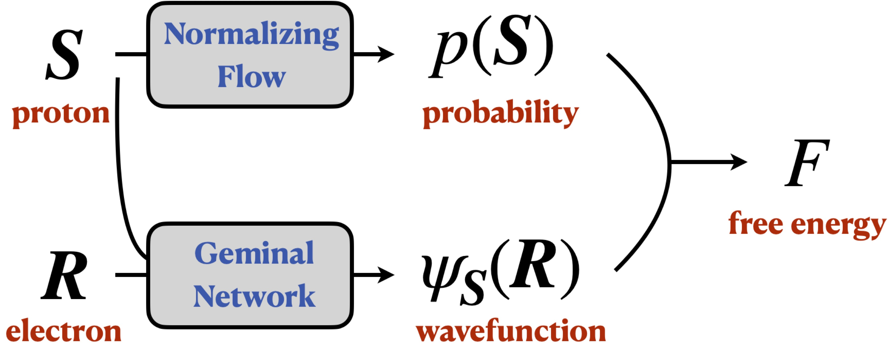

[](https://journals.aps.org/prl/abstract/10.1103/PhysRevLett.131.126501)

<div align="center">

<h1> Deep variational free energy approach to dense hydrogen</h1>
</div>


## Problem setup

Dense hydrogen consists of an equal number of protons and electrons in a box. We use a normalizing flow to model the proton Boltzmann distribution, and a fermionic neural network to model the electronic ground state. Then, we jointly optimize them to minimize the variational free energy of the whole system. The calculation provides equations of state of dense hydrogen (energy, pressure, entropy, etc at various densities). 





## Requirements

- [JAX](https://github.com/google/jax) 
- [haiku](https://github.com/deepmind/dm-haiku)
- [optax](https://github.com/deepmind/optax)


## Demo run
```bash
python ../src/main.py --T 6000 --rs 1.25 --n 14 --Gmax 15 --flow_steps 1 --flow_depth 3 --flow_h1size 32 --flow_h2size 16 --wfn_depth 3 --wfn_h1size 32 --wfn_h2size 16 --Nf 5 --K 1 --nk 33 --folder ../data/ --walkersize 512 --batchsize 4096 --mc_proton_steps 50 --mc_electron_steps 500 --mc_proton_width 0.02 --mc_electron_width 0.04 --lr_proton 1.0 --lr_electron 1.0 --decay 0.01 --damping_proton 0.001 --damping_electron 0.001 --maxnorm_proton 0.001 --maxnorm_electron 0.001 --clip_factor 5.0 --alpha 0.1 --acc_steps 1 --sr
```


## To cite

```
@article{PhysRevLett.131.126501,
  title = {Deep Variational Free Energy Approach to Dense Hydrogen},
  author = {Xie, Hao and Li, Zi-Hang and Wang, Han and Zhang, Linfeng and Wang, Lei},
  journal = {Phys. Rev. Lett.},
  volume = {131},
  issue = {12},
  pages = {126501},
  numpages = {8},
  year = {2023},
  month = {Sep},
  publisher = {American Physical Society},
  doi = {10.1103/PhysRevLett.131.126501},
  url = {https://link.aps.org/doi/10.1103/PhysRevLett.131.126501}
}
```
